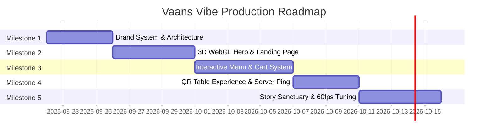

# ☕ VAANS VIBE — MASTER PROJECT BLUEPRINT & SPECIFICATION
**Cozy-Yet-Contemporary 3D Sensory Café Experience**  
*Document Version: 1.0.0 • Target Stack: Next.js 16 (App Router) + React 19 + Tailwind CSS 4 + Three.js / React Three Fiber + GSAP ScrollTrigger*

---

## 1. Executive Summary & Brand Identity

### 1.1 The Brand Concept
**Vaans Vibe** is an artisanal, contemporary café born at the intersection of slow living, organic warmth, and modern hospitality. It is designed to be a digital and physical sanctuary—a place where the noise of the outside world softens, replaced by the comforting hum of an espresso machine, the gentle rustle of indoor olive trees, and the warm aroma of freshly ground single-origin coffee.

The digital experience is not merely an online menu or informational brochure; it is an **immersive sensory extension** of the physical café. Visitors should feel the atmosphere, warmth, and tactile depth of Vaans Vibe before they ever step through our doors.

### 1.2 Core Brand Attributes
- **Tagline**: *"Where good vibes brew."*
- **Aesthetic Tone**: Soft-luxury, organic modernism, calm, slightly dreamy, tactile, and cinematic.
- **Sensory Anchors**: Warm sun-dappled lighting, textured ceramics, linen drapes, floating steam, roasted caramel notes, and soothing acoustic rhythms.
- **Brand Values**:
  1. *Artisanship*: Handcrafted pour-overs, stone-milled flours, direct-trade farm partnerships.
  2. *Mindful Pace*: Encouraging customers to pause, savor, and breathe.
  3. *Tactile Comfort*: Organic shapes, natural earth pigments, and effortless digital interactions.
  4. *Seamless Hospitality*: Frictionless QR table ordering, warm personalized service, and zero digital friction.

---

## 2. Physical Café Details & Operational Information

### 2.1 Location & Neighborhood Context
- **Address**:  
  `142 Bloom & Bean Boulevard, Serenita Arts Quarter, New York, NY 10012`  
  *(Alternative localized mock: 142 Koregaon Park / Indiranagar / Bandra West or downtown urban sanctuary)*
- **Neighborhood Vibe**: Tucked within an aesthetic cobblestone promenade lined with independent galleries, indie bookstores, and sunlit greenery.
- **Accessibility & Transit**:
  - 3-minute stroll from Serenita Station (Subway / Metro).
  - Curbside bicycle racks & electric scooter parking.
  - Wheelchair-accessible ramp and automatic sliding fluted timber doors.
  - Complimentary 2-hour validated underground parking at Bloom Green Garage.

### 2.2 Operating Hours & Service Timings
| Day | Café & Coffee Bar | Kitchen & Brunch Service | Evening Dessert & Acoustic Lounge |
| :--- | :--- | :--- | :--- |
| **Monday – Thursday** | 7:00 AM – 8:30 PM | 7:30 AM – 4:00 PM | 4:30 PM – 8:30 PM |
| **Friday – Saturday** | 7:00 AM – 10:00 PM | 7:30 AM – 4:30 PM | 5:00 PM – 10:00 PM (Live Music) |
| **Sunday** | 8:00 AM – 8:00 PM | 8:00 AM – 5:00 PM (All-Day Brunch) | 5:00 PM – 8:00 PM (Golden Hour Sessions) |

- **Golden Hour Ritual**: Daily between 4:00 PM – 6:00 PM featuring complimentary artisanal cantucci biscotti with any specialty pour-over or matcha latte.
- **Live Acoustic Nights**: Friday & Saturday evenings from 6:30 PM to 9:30 PM featuring local acoustic guitarists and indie soul duos.

### 2.3 Contact & Social Channels
- **Direct Phone / WhatsApp**: `+1 (555) 822-6784` (Spells `822-VIBE`)
- **General Inquiries & Reservations**: `hello@vaansvibe.cafe`
- **Private Gatherings & Workshops**: `events@vaansvibe.cafe`
- **Instagram**: `[@vaansvibe](https://instagram.com/vaansvibe)` (Curated coffee aesthetic, latte art, customer stories)
- **TikTok**: `[@vaansvibecafe](https://tiktok.com/@vaansvibecafe)` (Behind-the-barista reels, morning routine ASMR)
- **Curated Spotify Playlist**: `“Vaans Vibe: Slow Morning Acoustic & Lo-Fi Warmth”`

### 2.4 Physical Space & Architectural Zones
1. **The Sunlit Veranda**: Glass-enclosed greenhouse seating with climbing ivy, terracotta tiles, and morning eastern light.
2. **The Barista Counter**: Hand-poured curved micro-cement bar with brass espresso accents and open-facing pour-over stations.
3. **The Reading Nook & Library**: Deep bouclé armchairs, walnut shelving with indie design magazines, and warm 2700K directional reading lamps.
4. **The Co-Working Sanctuary**: Quiet zone with ergonomic oak worktables, discreet concealed power hubs, and high-speed Wi-Fi 6E.
5. **The Pet Courtyard**: Shaded brick outdoor garden with fresh water bowls, organic dog biscuits, and olive trees.

---

## 3. Visual Design System & Aesthetic Architecture

### 3.1 Color Palette & Token System
The color system reflects natural coffee extraction stages, sun-bleached ceramics, and organic botanicals:

| Token Name | Hex Code | HSL | Semantic Role |
| :--- | :--- | :--- | :--- |
| `espresso-deep` | `#3B2A2B` | `355°, 17%, 20%` | Primary brand tone, deep headers, dark buttons |
| `mocha-rich` | `#7B5B4A` | `21°, 25%, 39%` | Secondary elements, card accents, borders |
| `caramel-warm` | `#C69C6D` | `31°, 44%, 60%` | Warm highlight, primary active state, badge accents |
| `cream-beige` | `#EDE1C3` | `43°, 52%, 85%` | Primary background contrast, card surfaces |
| `linen-offwhite`| `#F8F1E9` | `32°, 54%, 95%` | Main canvas background, clean atmospheric space |
| `sand-light` | `#F4ECE1` | `35°, 46%, 92%` | Subtle container fill, soft card backgrounds |
| `terracotta-clay`| `#D97D64` | `13°, 61%, 62%` | Warm accent, callouts, spicy culinary notes |
| `sage-green` | `#8A9A86` | `106°, 10%, 57%` | Botanical plants, vegan/organic indicators |
| `gold-sheen` | `#D4AF37` | `46°, 65%, 52%` | Subtle luxury highlights, awards, star ratings |
| `charcoal-text` | `#231B1B` | `0°, 12%, 12%` | High-contrast body text, primary readability |
| `cocoa-muted` | `#635350` | `9°, 11%, 35%` | Secondary body text, metadata, descriptions |

### 3.2 Typography Hierarchy
- **Editorial Display / Headings**:  
  *Playfair Display* / *Cormorant Garamond* (Serif)  
  *Characteristics*: High contrast, elegant brackets, poetic italic flourishes. Evokes vintage European café culture with a contemporary polish.
- **Interface & Body Text**:  
  *Plus Jakarta Sans* / *Satoshi* (Geometric Sans-Serif)  
  *Characteristics*: Generous x-height, clear optical kerning, exceptional readability at small sizes on mobile devices.
- **Numbers, Prices & Badges**:  
  *JetBrains Mono* / *Outfit*  
  *Characteristics*: Monospaced tabular alignment for prices, table numbers, and order timestamps.

### 3.3 Tactile Depth & 3D Lighting Language
- **Soft Diffusion Shadows**: Dual-layer box shadows with low opacity and high blur radius:
  ```css
  box-shadow: 0 10px 30px -5px rgba(59, 42, 43, 0.08), 0 20px 50px -10px rgba(123, 91, 74, 0.05);
  ```
- **Cinematic Grain**: Subtle SVG procedural noise overlay at `opacity: 0.035`, creating a tactile matte paper finish across the viewport.
- **Glassmorphism**: Frosted glass navigation bars and modal overlays:
  ```css
  background: rgba(248, 241, 233, 0.82);
  backdrop-filter: blur(16px);
  border: 1px solid rgba(237, 225, 195, 0.5);
  ```
- **Volumetric 3D Scene**:
  - Three.js / React Three Fiber interactive canvas.
  - Floating roasted coffee beans with natural rotational inertia.
  - Rising steam particle shader using alpha-blended soft sprite quads.
  - Ambient botanical leaves swaying with cursor/gyroscope parallax.
  - Directional warm key light (`#FFEBD2`, intensity 1.8) and soft ambient fill (`#EDE1C3`, intensity 0.9).

---

## 4. Comprehensive Website Architecture & Web Pages

```mermaid
graph TD
    A["Landing / Home Page (/)"] --> B["Sensory Hero + 3D Canvas"]
    A --> C["The Story Teaser"]
    A --> D["Signature Creations Carousel"]
    A --> E["Atmosphere & Live Vibe Grid"]
    
    A --> F["Interactive Menu Page (/menu)"]
    F --> G["Sticky Category Selector"]
    F --> H["Dietary Filters & Search"]
    F --> I["3D Interactive Food/Drink Cards"]
    F --> J["Item Customization Drawer"]
    
    A --> K["Cart & Checkout (/cart, /checkout)"]
    K --> L["Fulfillment: Dine-In / Takeaway / Delivery"]
    K --> M["Tip & Special Instructions"]
    K --> N["Animated Order Confirmation & Tracker"]
    
    A --> O["About Us & Sanctuary (/about)"]
    O --> P["Bean Sourcing & Roasting Philosophy"]
    O --> Q["Interactive Location Map & Real-time Status"]
    O --> R["Event Calendar & Acoustic Sessions"]
    
    A --> S["Special QR Table Experience (/table/[id])"]
    S --> T["Instant 3D Steaming Mug Loader"]
    S --> U["Personalized Welcome to Table #"]
    S --> V["1-Tap Digital Ordering for Table"]
    S --> W["Instant Server Call / Water / Bill Ping"]
```



---

### 4.1 Page 1: Landing / Home Page (`/`)
1. **Cinematic 3D Hero Section**:
   - Full-viewport WebGL canvas with interactive 3D scene (floating coffee beans, delicate steam particles, ceramic coffee cup with subtle mouse-driven gyro tilt).
   - Large elegant branding: `"Vaans Vibe"` with staggered letter-by-letter reveal.
   - Poetic Tagline: *"Where good vibes brew. A sanctuary of slow sips, warm light, and gentle moments."*
   - Interactive CTAs:
     - `[Explore Menu]` (Smooth-scroll or route transition with soft page wipe)
     - `[Order Ahead / Dine-In]` (Launches order modal or route)
     - `[Our Sanctuary]` (Jumps to location & atmosphere)
   - Ambient Audio Toggle: Discreet corner button to play soft café background ambiance (espresso hiss, rain on glass, acoustic lo-fi chords).

2. **The Philosophy Teaser ("The Art of the Slow Sip")**:
   - Split-screen editorial layout: high-resolution photographic storytelling of handcrafted pour-overs alongside serif typography.
   - Parallax scroll effect revealing the warm texture of hand-thrown pottery and micro-cement surfaces.

3. **Featured Signatures Carousel (3D Card Tilt)**:
   - Interactive horizontal scroll showcase:
     - *Pistachio Cloud Latte* (House-made pistachio cream, double blonde espresso, oat milk, crushed roasted nuts).
     - *Golden Caramel Cortado* (Caramelized date reduction, steamed jersey milk, Ethiopian Yirgacheffe).
     - *Lavender Honey Brioche Toast* (Whipped farm ricotta, organic lavender honey, edible cornflowers, sourdough).
     - *Yuzu & Cascara Cold Brew* (Slow-dripped for 18 hours, infused with sparkling tonic and Japanese yuzu peel).
   - Each card features realistic 3D tilt on pointer move, tactile shadow expansion, and instant `+ Add to Cart`.

4. **Atmosphere & Community Feed**:
   - Curated aesthetic masonry photo grid capturing real café moments: latte art, sunlit reading nooks, pet courtyard friends, fresh pastry bakes.
   - Hover reveals photographer credits and flavor notes.

---

### 4.2 Page 2: The Interactive Menu Experience (`/menu`)
1. **Floating Category Navigation**:
   - Sticky top bar with smooth horizontal drag/scroll:
     - ☕ *Specialty Coffees & Pour-Overs*
     - 🧊 *Cold Brews & Tonics*
     - 🍵 *Ceremonial Matchas & Teas*
     - 🥐 *Artisanal Bakery & Sweet Treats*
     - 🥑 *Breakfast & All-Day Brunch*
     - 🥪 *Savory Bites & Warm Bowls*
     - ⭐ *Chef's Seasonal Curations*
2. **Smart Filters & Search**:
   - Dietary pill toggles: `Vegan`, `Gluten-Free`, `Dairy-Free`, `Nut-Free`, `High-Protein`.
   - Real-time search bar with instant fuzzy matching on item titles, ingredients, and tasting notes.
3. **Food & Drink Card Component**:
   - High-fidelity imagery with progressive blur-up loading.
   - Dietary badges (`[VG]`, `[GF]`, `[Signature]`).
   - Detailed tasting notes (e.g., *"Notes of dark cocoa, dried plum, and toasted macadamia"*).
   - Interactive Customization Modal:
     - Milk selection: Whole Jersey, Oatly Barista (+ $0.75), Almond (+ $0.75), Coconut (+ $0.75).
     - Sweetness scale: 0% Unsweetened, 25% Hint of Sweetness, 50% Balanced, 100% Full Sweet.
     - Extra Espresso Shot (+ $1.25), Decaf Option (Swiss Water Process).
     - Special dietary notes input for the barista/chef.
4. **Scroll-Driven Reveal**:
   - Powered by GSAP ScrollTrigger: staggered entrance with 3D Y-axis translation and opacity scaling as users navigate down the culinary catalog.

---

### 4.3 Page 3: Cart, Fulfillment & Order System (`/cart`, `/checkout`)
1. **Floating Cart Capsule**:
   - Persistent bottom-right pill showing current count, total price, and subtle warm pulsing glow when new items are added.
   - 1-click expands into a slide-over glassmorphic drawer without navigating away from the menu.
2. **Three Fulfillment Modes**:
   - 🍽️ **Dine-In**: Prompts for Table Number (auto-populated if accessed via QR code).
   - 🛍️ **Takeaway / Curbside Pickup**: Select pickup window (e.g., *"Ready in 15–20 minutes"* or scheduled time).
   - 🛵 **Neighborhood Delivery**: Address input, delivery fee calculation, courier notes (e.g., *"Leave on porch with care"*).
3. **Streamlined Checkout Flow**:
   - Guest checkout by default: Name, Phone Number (for SMS order ready alerts), Email.
   - Gratuity / Tip Selector: `10%`, `15%`, `20%`, `Custom`, or `No Tip`.
   - Payment Methods: Apple Pay, Google Pay, Credit/Debit Card, or Pay at Counter (for Dine-In).
4. **Order Confirmation & Real-Time Status**:
   - 3D animated ceramic cup being gently filled with freshly brewed coffee.
   - Real-time step progress bar:
     1. `Order Received` (Kitchen acknowledged)
     2. `Grinding & Brewing` (Barista crafting your order)
     3. `Plating & Garnishing` (Final culinary touches)
     4. `Ready for Table / Pickup` (Order completed)

---

### 4.4 Page 4: About Us, Philosophy & Location Sanctuary (`/about`)
1. **The Origin Story & Philosophy**:
   - The philosophy of *“Slow Coffee”* in a fast world.
   - Sustainable sourcing: Direct-trade relationships with women-led farming cooperatives in Huila (Colombia) and Sidama (Ethiopia).
   - Architectural inspiration: Japandi minimalism blended with Mediterranean warmth (reclaimed timber, limewash walls, hand-spun linen).
2. **Interactive Location Sanctuary**:
   - Custom-styled vector map matching the café color palette (cream beige roads, espresso coffee pins, sage green parklands).
   - Real-Time Status Badge:
     - Automatically checks current local time against business hours.
     - Displays: `"Open Now • Closes at 8:30 PM"` (with green glowing beacon) or `"Currently Resting • Opens Tomorrow at 7:00 AM"`.
   - 1-Click Directions: Links to Google Maps, Apple Maps, and Waze.
3. **The Sound of Vaans Vibe**:
   - Embedded interactive audio player showcasing the current café playlist.
   - Direct link to Spotify and Apple Music playlists.
4. **Community & Events Calendar**:
   - Upcoming Coffee Cupping & Tasting Masterclasses.
   - Weekend Morning Yoga & Cold Brew sessions in the Pet Courtyard.

---

### 4.5 Page 5: Dedicated Table QR Code Experience (`/table/[tableId]`)
*This is one of the most critical customer touchpoints.* When a diner sits at Table 04 and scans the wooden engraved QR code:

1. **Instant Loading Screen (< 1.2s)**:
   - Zero app installation required; runs instantly in Safari / Chrome / Android browser.
   - 3D steaming ceramic coffee cup rotates smoothly, and the steam forms the glowing letters: *"Welcome to Table 04"*.
2. **Dedicated Table Dashboard**:
   - Friendly greeting: *"Welcome to Table 04, take a breath and enjoy the vibe."*
   - Current Table Status: Active / Open tab.
   - Quick Action Grid:
     - 📜 **[View Full Table Menu]**: Seamlessly opens categorized menu with pre-bound `tableId: 04`.
     - 💧 **[Request Fresh Water]**: Instant 1-tap ping to barista console.
     - 🙋‍♂️ **[Call Server / Assistance]**: Notifies front-of-house team.
     - 🧾 **[Request Bill / Close Tab]**: Selects payment method right from the chair.
3. **In-Table Ordering**:
   - Orders placed from this view bypass takeaway queues and go directly to the barista/kitchen display system with the table number attached.
   - Diners can add items continuously to their active table tab (e.g., ordering an extra pastry or cold brew halfway through their conversation).

---

## 5. Strategic Goal Segmentation & Development Milestones

To bring this vision into a fully functional, high-performance reality, the project is structured into **5 sequential milestones**:



---

### Milestone 1: Brand System, UI Tokens & Architectural Foundation
- **Goal**: Establish the technical backbone, design tokens, typography, and responsive layout shell.
- **Scope & Deliverables**:
  1. Tailwind CSS 4 theme setup with custom palette tokens (`espresso-deep`, `caramel-warm`, `cream-beige`, etc.).
  2. Font integration: *Playfair Display* (display serif) + *Plus Jakarta Sans* (body sans) + *JetBrains Mono* (numeric).
  3. Reusable UI component library:
     - Primary & Secondary Button variants with tactile micro-hover effects.
     - Glassmorphic navigation bar with mobile drawer.
     - Global footer with location, hours, social links, and newsletter signup.
     - Modal and Drawer primitives using accessible dialog standards.
  4. Global state store for shopping cart and active table session (Zustand / React Context).
- **Acceptance Criteria**:
  - Full responsive layout across Mobile (390px), Tablet (768px), and Desktop (1440px+).
  - Design tokens strictly adhered to without arbitrary colors.
  - Zero TypeScript errors and clean build output.

---

### Milestone 2: Immersive 3D Sensory Hero & Landing Page
- **Goal**: Deliver the show-stopping 3D visual first impression that captivates visitors.
- **Scope & Deliverables**:
  1. Three.js / React Three Fiber Hero Canvas:
     - Procedural or low-poly GLTF coffee bean particles floating with soft random brownian motion.
     - Custom GLSL or sprite particle steam animation rising gently from a central ceramic mug.
     - Mouse and touch pointer parallax response.
     - Fallback graceful CSS animation for low-power mobile devices.
  2. GSAP ScrollTrigger Integration:
     - Hero headline split-text entrance animation.
     - Parallax scrolling on atmosphere image cards.
     - Horizontal featured drinks carousel with 3D card tilt on hover.
  3. Interactive Ambient Sound Player:
     - Subtle audio controller with play/pause and volume slider.
  4. Instagram/Community photo grid with smooth lightbox preview.
- **Acceptance Criteria**:
  - 60 FPS performance during scroll and 3D interaction on modern devices.
  - WebGL context cleans up cleanly on route changes (no memory leaks).
  - Hero loads within 1.5s with progressive asset loading.

---

### Milestone 3: Interactive Menu, Filtering & Multi-Channel Cart System
- **Goal**: Create an appetizing, high-conversion digital menu and checkout experience.
- **Scope & Deliverables**:
  1. Menu Data Architecture (`src/data/menu.ts`):
     - Complete item catalog across 7 categories with prices, descriptions, tasting notes, allergens, and dietary flags.
  2. Category Bar & Filter Controls:
     - Sticky category pill navigation that highlights the active section during scroll.
     - Instant filter toggles for Vegan, Gluten-Free, Dairy-Free, and Nut-Free.
     - Live search bar with instant query filtering.
  3. 3D Card Hover & Customization Modal:
     - Card lift and soft shadow expansion on hover.
     - Customization drawer: milk selection, sweetness level, extra shots, and barista notes.
  4. Cart & Checkout Drawer:
     - Slide-over cart with item quantity increment/decrement.
     - Fulfillment toggle: Dine-In (Table #), Takeaway (Pickup Time), Delivery (Address).
     - Tip selector and price summary (subtotal, tax, gratuity, total).
     - Order submission with animated confirmation modal and order tracking timeline.
- **Acceptance Criteria**:
  - Cart persists across page reloads via `localStorage`.
  - Adding items triggers fluid micro-animation on the cart pill.
  - Customizations accurately reflect in total price and item breakdown.

---

### Milestone 4: Dedicated Table QR Code Experience
- **Goal**: Provide a frictionless, native-feeling in-café dining workflow triggered by scanning table QR codes.
- **Scope & Deliverables**:
  1. Dynamic Route: `/table/[tableId]` (e.g., `/table/04`).
  2. 3D Table Onboarding Animation:
     - Steaming mug animation morphing into: *"Welcome to Table 04 at Vaans Vibe"*.
  3. Table Dashboard View:
     - Table status badge and active tab overview.
     - 1-Tap Quick Action Buttons:
       - `[Order Food & Drinks]` -> Launches table-bound menu.
       - `[Request Water]` -> Triggers confirmation toast and simulates staff dispatch.
       - `[Call Server]` -> Triggers waiter assistance request.
       - `[Request Bill]` -> Prompts payment preference.
  4. Table Ordering Pipeline:
     - Automatically injects `tableId` into all orders submitted from this route.
     - Shows live order status pinned to the bottom of the table screen.
- **Acceptance Criteria**:
  - Route works smoothly on mobile browsers (Safari iOS and Chrome Android).
  - Quick actions provide instant tactile feedback with haptic-like animations.
  - Diners can place multiple subsequent orders on the same table session.

---

### Milestone 5: About Sanctuary, Real-Time Hours, SEO & 60fps Production Polish
- **Goal**: Complete brand storytelling, provide real-time operational status, and optimize for top-tier performance.
- **Scope & Deliverables**:
  1. About Us Page (`/about`):
     - Editorial brand narrative with quotes and photographic galleries.
     - Sourcing & sustainability highlights.
     - Interactive Location Map with custom brand styling.
     - Real-Time "Open Now / Closed" calculation logic based on current system time.
     - Event calendar & newsletter subscription form with validation.
  2. Technical SEO & Social Sharing:
     - Complete metadata titles, descriptions, and OpenGraph/Twitter card images.
     - JSON-LD structured data schema for `CafeOrRestaurant` (specifying name, address, geo-coordinates, openingHoursSpecification, menu URL, and price range).
  3. Performance & Accessibility Audit:
     - Full keyboard navigation and ARIA attributes for modals and drawers.
     - `prefers-reduced-motion` compliance across all GSAP and CSS animations.
     - Image optimization with Next.js `<Image />` with `sizes` and WebP/AVIF formats.
- **Acceptance Criteria**:
  - Lighthouse performance score > 90 on Desktop and Mobile.
  - Zero accessibility violations on automated axe/Lighthouse audits.
  - Rich snippets correctly validate against Google's Rich Results Test for Restaurant schema.

---

## 6. Technical Stack & Architecture Summary

| Layer | Selected Technology | Rationale |
| :--- | :--- | :--- |
| **Framework** | **Next.js 16 (App Router) + React 19** | Modern server/client component boundaries, optimized routing, and future-proof React 19 features. |
| **Styling** | **Tailwind CSS 4** | Modern CSS theme tokens, zero-runtime overhead, and effortless responsive utility mapping. |
| **3D Engine** | **Three.js / React Three Fiber (R3F)** | Industry benchmark for WebGL rendering; declarative component model for floating particles, lights, and models. |
| **Animation** | **GSAP (GreenSock) + ScrollTrigger** | Unrivaled 60fps buttery scroll orchestration, timeline sequencing, and physics-driven spring reveals. |
| **Icons** | **Lucide React** | Consistent, clean geometric icons matching our minimalist sans-serif typography. |
| **State Management** | **Zustand / React Context** | Lightweight, predictable state for shopping cart, active table session, and audio player state. |
| **Type Safety** | **TypeScript 5** | Strict types for menu data, order payloads, customization options, and component props. |

---

## 7. Next Steps & Execution Roadmap
With this master blueprint established, development can proceed systematically across the 5 milestones:
1. Initialize the design tokens, fonts, and layout foundations.
2. Build the immersive 3D Hero and Landing experience.
3. Construct the interactive Menu catalog and Cart drawer.
4. Implement the dedicated `/table/[tableId]` QR experience.
5. Finalize the About sanctuary, real-time hours, and 60fps production optimization.

*Vaans Vibe — Where good vibes brew.*
