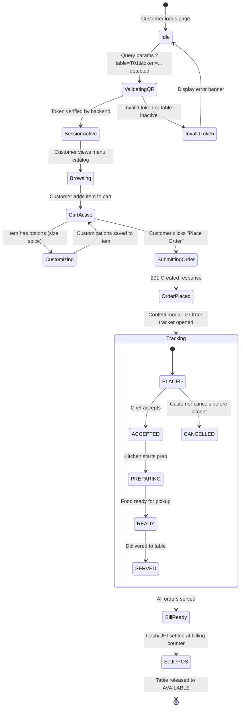

# Van Vibes Frontend Feature-to-File Relationship Map

This document establishes the bidirectional mapping between user-facing capabilities, Next.js routes, feature modules, components, services, and backend API contracts.

---

## 1. Feature-to-Code Mapping Matrix

| Feature Domain | Capability & User Experience | Next.js Route(s) | Primary Feature Components | Hooks & Context | Services & API Endpoints | Backend Contract (:9000) |
| :--- | :--- | :--- | :--- | :--- | :--- | :--- |
| **Table & QR Session** | • Mobile QR standee scan • Security token validation • Table binding & active session attach • Active session recovery | `/cafe/[cafeId]/menu` `/cafe/van-vibes/menu` `/cafe/vaan-vibes/menu` `/menu` `/` | `MenuClient.tsx` `CafeHeader.tsx` `TableHeaderPill.tsx` | `useTableSession` `CartContext` | `tableService` `POST /api/qr/validate` `GET /api/tables` | `POST /api/v1/tables/validate-qr` `GET /api/v1/tables` |
| **Menu Catalog & Browsing** | • Food item catalog browsing • Sticky category horizontal scroller • Veg / Non-Veg / Vegan filters • Spice level and badge indicators • Out-of-stock (86) indicators | `/cafe/[cafeId]/menu` `/cafe/van-vibes/menu` `/menu` | `CategoryNav.tsx` `FoodCard.tsx` `ItemCustomizationModal.tsx` | `useMenuFilter` `useMenu` | `menuService` `GET /api/menu` | `GET /api/v1/menu` `GET /api/v1/categories` |
| **Instant Menu Search** | • Overlay fuzzy search modal • Instant keyword highlighting • Direct Add to Cart from search | Overlay across all menu pages | `SearchModal.tsx` | `useMenuSearch` `CartContext` | In-memory index over canonical menu catalog | Local / cached catalog |
| **Cart & Guest Checkout** | • Slide-over cart drawer • Quantity increment/decrement • Customizations display • Special kitchen instructions • Customer name & phone input • Authoritative total calculation | Overlay across all menu pages | `CartDrawer.tsx` `CartItemList.tsx` `CustomerForm.tsx` | `useCart` `CartContext` | `CartContext` local storage sync (`vv_cart`) | Evaluated on order placement |
| **Order Placement & Confirmation** | • Atomic order submission • Multi-order per table session support • Confetti celebration modal • Order summary receipt preview | Modal overlay | `OrderConfirmationModal.tsx` | `useCart` `useOrderPlacement` | `orderService` `POST /api/orders` | `POST /api/v1/orders` (201 Created) |
| **Real-Time Order Tracking** | • Live 5-stage status progress (Placed -> Preparing -> Ready -> Served) • Polling fallback & WebSocket listener • Order cancellation (within grace window) • Consolidated session bill receipt viewer | Modal overlay (`isOrdersOpen`) | `OrderTrackingModal.tsx` `ConfirmationModal.tsx` `PrintableReceipt.tsx` | `useOrderTracking` `useCart` | `orderService` `GET /api/orders` `POST /api/orders/[id]/cancel` `GET /api/billing/[orderId]` | `GET /api/v1/orders` `POST /api/v1/orders/{id}/cancel` `GET /api/v1/billing/{order_id}` |
| **Cafe Branding & Info** | • Cafe logo, Hindi/English branding • Operating hours, address, phone • Table number badge • Quick action triggers | Header across all menu pages | `CafeHeader.tsx` | `CartContext` | `SiteConfig` `CAFE_INFO` | Static configuration |

---

## 2. Reusable UI Primitives (`src/components/ui/`)

| Component | Responsibility | Props Interface | Usages |
| :--- | :--- | :--- | :--- |
| **`ConfirmationModal.tsx`** | Accessible confirmation dialog for destructive actions (clear cart, cancel order) | `ConfirmationModalProps` (`isOpen`, `title`, `message`, `confirmText`, `onConfirm`, `onClose`) | CartDrawer, OrderTrackingModal |
| **`ScrollReveal.tsx`** | Performance-friendly IntersectionObserver animation wrapper | `ScrollRevealProps` (`children`, `direction`, `delay`, `distance`, `duration`) | MenuClient, FoodCard |
| **`Spinner.tsx`** | Standard branded loading spinner with customizable sizing and color | `SpinnerProps` (`size`, `className`) | Route loading fallbacks, async buttons |

---

## 3. Core Data Flow & State Lifecycle

