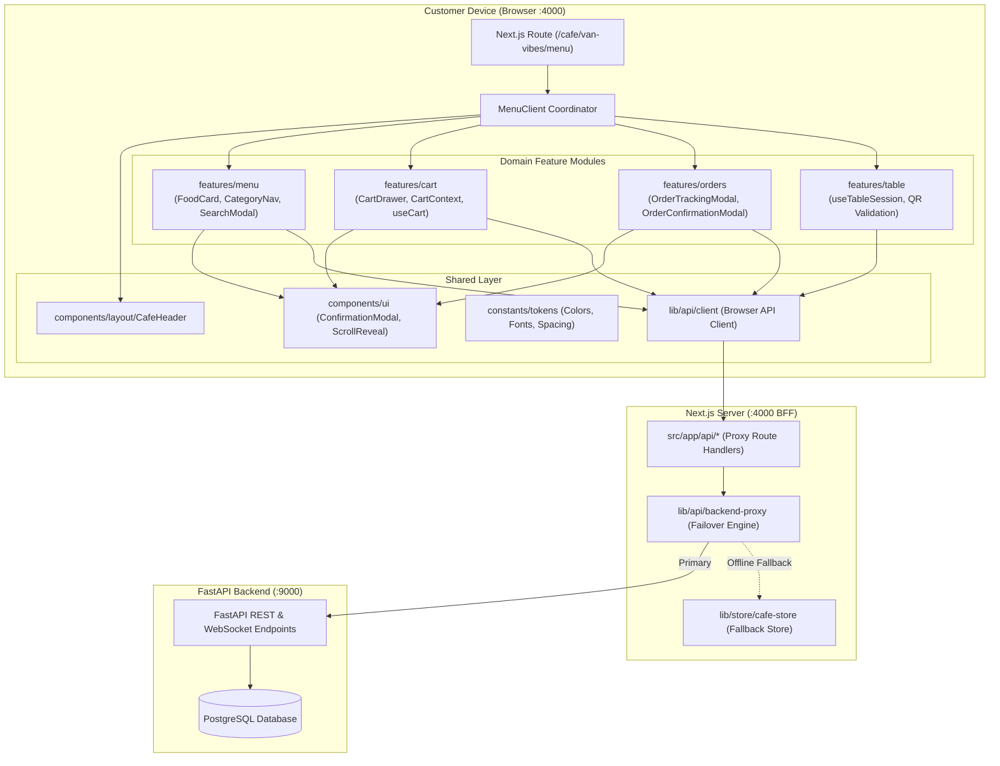
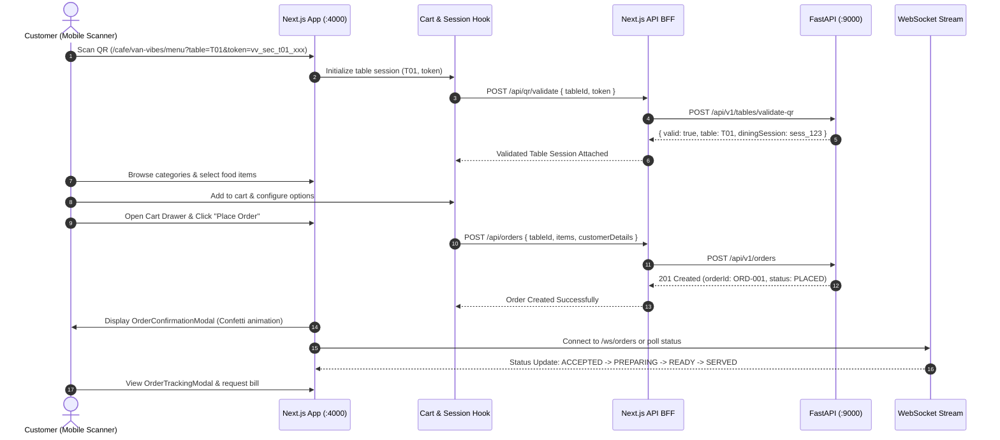

# Van Vibes Frontend Architecture & Target Design Specification

## Executive Summary

This document outlines the architectural blueprint, module organization, design token strategy, and refactoring roadmap for the **Van Vibes Customer Frontend** (`van-vibes-frontend`), built on **Next.js 16.3.4 (App Router)**, **React 19.2.8**, **Tailwind CSS v4**, and **TypeScript 5**.

The goal of this refactoring is to transition from a flat, partially monolithic component structure into a **clean, modular, feature-oriented frontend architecture** while preserving 100% of existing UI, business workflows, API contracts, and user experience.

---

## 1. Baseline Audit & Key Findings

### 1.1 Technical Stack & Environment Baseline
- **Framework**: Next.js 16.3.4 (App Router with Turbopack).
- **Core Runtime**: React 19.2.8, React DOM 19.2.8.
- **Styling**: Tailwind CSS v4 (`@tailwindcss/postcss` ^4, `@theme` directive in `globals.css`).
- **Icons & Visuals**: `lucide-react`, `three`, `canvas-confetti`.
- **Quality Tooling**: TypeScript 5 (`tsc --noEmit`), ESLint 9, Vitest 5 (`vitest run`).
- **Baseline Quality Status**:
  - `pnpm typecheck`: **0 errors (100% clean)**
  - `pnpm lint`: **0 warnings / 0 errors**
  - `pnpm test`: **7 test suites, 33 tests passed (100%)**
  - `pnpm build`: **Turbopack compiled successfully across all 12 routes**

### 1.2 Identified Architectural Deficiencies
1. **Monolithic Context (`CartContext.tsx` - 525 lines)**:
   - Conflates cart items arithmetic, table/QR validation, active order polling, UI modal toggles (`isCartOpen`, `isOrdersOpen`, `isSearchOpen`), category navigation state, and dynamic menu fetching into a single giant provider.
2. **Flat Component Organization (`src/components/`)**:
   - All 11 components are dumped into a single root folder without distinction between reusable UI primitives (`ui/`), application layout (`layout/`), and feature-specific business workflows (`features/`).
3. **Dual & Inconsistent Design Token Definitions**:
   - `src/constants/colors.ts`: Defines `AppColors` with keys `brandGreen`, `brandBeige`, `goldAccent`, `bgPrimary`.
   - `src/constants/brand.ts`: Defines a conflicting `AppColors` with keys `primary`, `beige`, `gold`, `lightBackground`.
   - `src/app/globals.css`: Defines CSS variables (`--color-brand-green`, `--color-brand-beige`, etc.) in `@theme`.
   - Components still have sporadic inline hex codes (`#18312B`, `#FAF5EC`, `#C8A25D`).
4. **Legacy Corporate Template Artifacts**:
   - Unused type files from template: `types/blog.ts`, `types/career.ts`, `types/case-study.ts`, `types/product.ts`, `types/solution.ts`.
   - Unused navigation arrays in `constants/brand.ts`: `AppNavLinks` (Careers, Products, Blog), `ProductNavLinks` (Solutions, Use Cases), `SupportedLanguages`.
5. **Direct Inline Client-Side Fetching**:
   - No standardized client-side API service abstraction; components and contexts call `fetch('/api/...')` with manual error handling and JSON parsing.

---

## 2. Target Feature-Oriented Directory Architecture

```text
src/
├── app/                                 # Next.js App Router (Routes, Layouts, Server Handlers)
│   ├── layout.tsx                       # Root layout (General Sans font, Theme wrapper, CartProvider)
│   ├── page.tsx                         # / (Root customer entry point)
│   ├── loading.tsx                      # Global loading state
│   ├── error.tsx                        # Global error boundary
│   ├── not-found.tsx                    # 404 handler
│   ├── globals.css                      # Tailwind v4 @theme, typography, print styles
│   ├── cafe/                            # Route: /cafe/[cafeId]/menu
│   │   ├── [cafeId]/menu/page.tsx       # Dynamic cafe table menu
│   │   ├── van-vibes/menu/page.tsx      # Canonical Van Vibes route
│   │   └── vaan-vibes/menu/page.tsx     # Legacy alias route
│   ├── menu/page.tsx                    # Direct menu alias
│   └── api/                             # Server Route Handlers (BFF Proxy & Fallback Engine)
│       ├── tables/route.ts
│       ├── qr/validate/route.ts
│       ├── menu/route.ts
│       ├── orders/route.ts
│       ├── orders/[id]/route.ts
│       ├── orders/[id]/cancel/route.ts
│       ├── billing/[orderId]/route.ts
│       └── health/route.ts
│
├── features/                            # Domain-Driven Business Modules
│   ├── menu/                            # Menu catalog browsing & search
│   │   ├── components/
│   │   │   ├── FoodCard.tsx             # Food item presentation card
│   │   │   ├── CategoryNav.tsx          # Sticky category bar with active pill
│   │   │   ├── ItemCustomizationModal.tsx # Options & add-ons selector
│   │   │   └── SearchModal.tsx          # Fast fuzzy search overlay
│   │   ├── hooks/
│   │   │   └── useMenuFilter.ts         # Category selection & search filtering
│   │   ├── services/
│   │   │   └── menuService.ts           # Dynamic menu retrieval & caching
│   │   ├── types/
│   │   │   └── index.ts                 # Re-exports of MenuItem, Category
│   │   └── index.ts
│   │
│   ├── cart/                            # Guest ordering cart & checkout
│   │   ├── components/
│   │   │   ├── CartDrawer.tsx           # Slide-over checkout drawer
│   │   │   ├── CartItemList.tsx         # Item rows with quantity steppers
│   │   │   └── CustomerForm.tsx         # Table & customer phone input
│   │   ├── context/
│   │   │   ├── CartContext.tsx          # Focused cart state provider
│   │   │   └── useCart.ts               # Hook to consume cart state
│   │   └── index.ts
│   │
│   ├── orders/                          # Order lifecycle, live tracking & receipts
│   │   ├── components/
│   │   │   ├── OrderConfirmationModal.tsx # Success dialog with confetti
│   │   │   ├── OrderTrackingModal.tsx   # Live step tracker (Placed -> Served)
│   │   │   └── PrintableReceipt.tsx     # Print-ready bill receipt component
│   │   ├── hooks/
│   │   │   └── useOrderTracking.ts      # Polling & WebSocket order updates
│   │   ├── services/
│   │   │   └── orderService.ts          # Order creation, status check & cancellation
│   │   └── index.ts
│   │
│   └── table/                           # Table QR validation & session binding
│       ├── components/
│       │   └── TableHeaderPill.tsx      # Table number badge in header
│       ├── hooks/
│       │   └── useTableSession.ts       # Query-param token validation hook
│       ├── services/
│       │   └── tableService.ts          # QR validation & table metadata
│       └── index.ts
│
├── components/                          # Shared Application-Wide Components
│   ├── ui/                              # Pure Reusable UI Primitives
│   │   ├── ConfirmationModal.tsx        # Generic two-button alert dialog
│   │   ├── ScrollReveal.tsx             # Animation wrapper
│   │   └── Spinner.tsx                  # Standard branded spinner
│   │
│   ├── layout/                          # Global Layout Shells
│   │   └── CafeHeader.tsx               # Top navigation with branding & quick actions
│   │
│   └── MenuClient.tsx                   # Page-level composition coordinator
│
├── config/                              # Centralized Environment & App Configuration
│   └── env.ts                           # Multi-tier host & port resolution (4000/9000)
│
├── constants/                           # Authoritative Design Tokens & Brand Meta
│   ├── tokens.ts                        # Centralized colors, spacing, shadows, radius
│   ├── brand.ts                         # Cafe identity, tagline, address, GSTIN
│   ├── assets.ts                        # Static logos, fonts, illustration paths
│   └── index.ts
│
├── lib/                                 # Infrastructure & Core Utilities
│   ├── api/
│   │   ├── client.ts                    # Unified browser HTTP client
│   │   └── backend-proxy.ts             # Server-side proxy to FastAPI with multi-target failover
│   ├── logger/                          # Centralized logging engine
│   ├── store/
│   │   └── cafe-store.ts                # In-memory mock/fallback store
│   ├── utils.ts                         # Tailwind clsx/twMerge utility
│   └── seo.ts                           # Dynamic JSON-LD & OpenGraph generators
│
├── data/                                # Static Seed Data
│   ├── site-config.ts                   # Site meta & navigation
│   └── vaan-vibes-menu.ts               # Authoritative seed menu catalog (140+ items)
│
└── types/                               # Genuinely Shared Application Types
    ├── cafe.ts                          # Core cafe domain models
    ├── site.ts                          # Site navigation & SEO schemas
    └── index.ts
```

---

## 3. Architectural Diagrams

### 3.1 Feature Architecture & Data Flow



### 3.2 End-to-End Customer Journey



---

## 4. Centralized Theme & Design Token Strategy

All visual tokens are centralized into a single authoritative module: `src/constants/tokens.ts`, which synchronizes with `src/app/globals.css` `@theme`.

### Token Mapping:
| Semantic Token | Hex Value | CSS Variable | Usage |
| :--- | :--- | :--- | :--- |
| **`brandGreen`** | `#18312B` | `--color-brand-green` | Primary branding, deep dark forest green, primary buttons, headings |
| **`brandGreenDeep`** | `#0E1F1B` | `--color-brand-green-deep` | Dark backgrounds, elevated cards in dark mode |
| **`brandGreenLight`** | `#244941` | `--color-brand-green-light` | Hover states on green buttons, secondary badges |
| **`brandGreenSurface`**| `#1E3D36` | `--color-brand-green-surface` | Modal headers, card surfaces |
| **`brandBeige`** | `#F5E9D3` | `--color-brand-beige` | Warm beige secondary background, pill backgrounds |
| **`brandBeigeLight`** | `#FAF5EC` | `--color-brand-beige-light` | Default application body background |
| **`brandBeigeDark`** | `#E6D4B7` | `--color-brand-beige-dark` | Borders, divider lines, muted cards |
| **`brandBeigeMuted`** | `#D8C2A0` | `--color-brand-beige-muted` | Scrollbar thumb, disabled borders |
| **`brandGold`** | `#C8A25D` | `--color-brand-gold` | Gold accents, ratings, special highlights |
| **`brandGoldLight`** | `#E0C182` | `--color-brand-gold-light` | Gold hover, pill active backgrounds |
| **`brandTerracotta`** | `#D96B43` | `--color-brand-terracotta` | Spicy indicators, non-veg badges, alert highlights |

---

## 5. Reviewable Implementation Phases

### Phase 1: Baseline Audit & Documentation (Completed)
- Run typecheck, lint, test, and build to confirm 100% baseline pass.
- Create formal architecture and feature mapping specifications.

### Phase 2: Design Token & Shared UI Consolidation
- Unify `src/constants/colors.ts` and `src/constants/brand.ts` into authoritative `src/constants/tokens.ts` and clean `brand.ts`.
- Extract reusable UI primitives: `ConfirmationModal`, `ScrollReveal`, `Spinner` into `src/components/ui/`.
- Verify backward compatibility.

### Phase 3: Domain Feature Modules Extraction
- Extract `features/menu/`: `FoodCard`, `CategoryNav`, `ItemCustomizationModal`, `SearchModal`.
- Extract `features/cart/`: `CartDrawer`, `useCart`.
- Extract `features/orders/`: `OrderConfirmationModal`, `OrderTrackingModal`.
- Extract `features/table/`: `useTableSession`.
- Refactor `CartContext` to delegate domain concerns cleanly.

### Phase 4: Shared Client API & Service Layer
- Create `src/lib/api/client.ts` for unified client-side REST calls.
- Encapsulate `menuService`, `orderService`, `tableService`.

### Phase 5: Cleanup & Deprecations
- Remove unused legacy types (`career.ts`, `blog.ts`, `product.ts`, `solution.ts`, `case-study.ts`).
- Update imports across all route pages, components, and tests.

### Phase 6: Comprehensive Verification
- Execute `pnpm typecheck`, `pnpm lint`, `pnpm test`, `pnpm build`.
